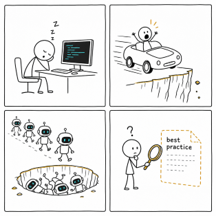
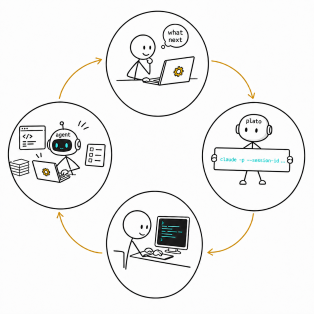
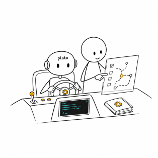

<div align="center">
  
</div>

# Plato

*Built for engineers who get tickets, not greenfield projects.*

> **⚠️ Warning: if you are not a professional engineer, Plato is not for
> you.** It assumes you're a software engineer with years of hands-on
> experience, comfortable with Jira, Scrum, git, and professional software
> project workflows in general. If that's not you, look at fully-automated
> tools like Superpowers or GSD instead.

Plato is an AI coding methodology framework for Claude Code. It is designed
around how real engineers on real teams actually work: you get a ticket not an
open-ended mandate to build something from scratch. 

Plato organizes the whole lifecycle of that ticket, from requirement to reviewed diff, as a
sequence of small, transparent, human-checkpointed AI sessions.

## Quick Start

```
/plato init
/plato HELLO-0001
```

That starts your first ticket.

Before you use Plato for real, you **must** read the [tutorial](tutorial/01-begin.md).

> **😱 You might be worried the tutorial will be long and boring.** I can
> promise you it will be — **long and boring** , exactly like a Defense
> Against the Dark Arts class🪄. If you're not a real software engineer, or don't have
> the patience of one, this framework genuinely isn't for you.

## Why Plato

AI coding today has four recurring problems:

1. **Your attention breaks down.** Watching an agent write code makes you
   doze off; run several tasks at once and switch between them, and you
   forget what you were doing by the time you switch back.
2. **The project becomes uncontrollable.** It's like a car accelerating with
   no one on the wheel — by the time you notice it's off course, it's
   already gone too far to easily correct.
3. **Nothing is learned.** The rules that should govern how you and the AI
   work together never accumulate anywhere, so the AI keeps making the same
   mistakes.
4. **There's no best practice.** This is the one that matters most: engineers
   on a real project team find that none of the tools on the market actually
   fit enterprise-grade development — there's no established best practice
   to follow.

<div align="center">
  
</div>

A handful of simple, repeated actions resolve all four problems. Once
Plato is part of your routine, your day-to-day be like:

<div align="center">
  
</div>

## Philosophy

### Framework, not platform

Plato is deliberately a **framework** (like Spring or React), not a
**platform** (like a low-code tool or a fully automated agent runner). It
gives you conventions, scaffolding, and best practices — it does not
generate your design for you, run agents unsupervised, or make decisions on
your behalf. Every step is visible and stays under your control.

| | GSD | Superpowers | Plato |
|---|---|---|---|
| Type | Platform | Plugin system | Framework |
| Transparency | Low (black box) | Medium | High (white box) |
| Target user | Solo developer | General developer | Team engineer |
| State management | In-memory (TodoWrite) | In-memory | File-based (persistent) |
| Session model | Long sessions | Long sessions | Short `-p` sessions |
| ABS generation | Automated | Automated | Manual (engineer writes) |

### Rule-Oriented Programming

<div align="center">
  
</div>

ABR — **Agent Behavior Rules** — is the collective name for the markdown
files that constrain how an agent works on a project: `AGENTS.md`,
`CLAUDE.md`, `ARCHITECTURE.md`, `NEVER.md`, and the like. In this new era of
software engineering, the most valuable thing an engineer produces is no
longer the code — it's the ABR files that shape how that code gets written.
Plato refines your ABR files at every step of every ticket, so the longer
you use it, the more your project accumulates an ABR library that's
tailored specifically to it.

### Loose, Transparent, and Honest

<div align="center">
  
</div>

We're software engineers. We like transparency, because we need our
projects to stay controllable. Every checkpoint in Plato's workflow can be
edited by hand, restarted, or redesigned at any time — you can change
anything. This isn't vibe coding, and you're not working inside a closed
framework; the framework is assisting *you*. You are the one driving,
reviewing, and deciding. The cost is that Plato isn't one-click — it takes
some learning to use well.

### Slow down

<div align="center">
  
</div>

Working with Plato will feel slow — much slower than the one-click
frameworks out there. That's because every step requires you to step in.
It's still much faster than writing everything by hand, though. While other
tools race to make AI coding faster, Plato deliberately tries to slow it
down, because staying in control of the project matters more than raw
speed.

## Installation

This repository *is* a Claude Code Skill named `plato`. Install it with the
[skills CLI](https://github.com/anthropics/skills):

```
npx skills@latest add CodePlato3721/plato -y -g
```

This fetches the skill into your global skills directory, making `/plato`
available in Claude Code.

