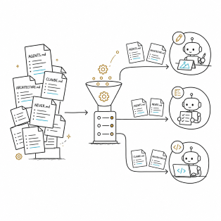

<div align="center">
  
</div>

# Plato

*Built for engineers who get tickets, not greenfield projects.*

> **⚠️ Warning: if you are not a professional engineer, Plato is not for
> you.** It assumes you're a software engineer with years of hands-on
> experience, comfortable with Jira, Scrum, git, and professional software
> project workflows in general. If that's not you, look at fully-automated
> tools like Superpowers or GSD instead.

Plato is an AI coding methodology framework for Claude Code. It is built for
real engineers working on brownfield projects: you get a ticket not an
open-ended mandate to build something from scratch. 

Plato organizes the whole lifecycle of that ticket, from requirement to reviewed diff, as a
sequence of small, transparent, human-checkpointed AI sessions.

## Installation

This repository *is* a Claude Code Skill named `plato`. Install it with the
[skills CLI](https://github.com/anthropics/skills):

```
npx skills@latest add CodePlato3721/plato -y -g
```

This fetches the skill into your global skills directory, making `/plato`
available in Claude Code.

## Quick Start

```
/plato init
/plato HELLO-0001
```

That starts your first ticket.

Before you use Plato for real, you **must** read the [tutorial](tutorial/01-begin.md).

> **😱 You might be worried the tutorial will be long and boring.** I can
> promise you it will be — **long and boring** , exactly like a Defense
> Against the Dark Arts class🪄. If you're not a real software engineer, or don't have
> the patience of one, this framework genuinely isn't for you.

## Why Plato

Plato is built around four ideas:

1. **Built for brownfield projects.** There are plenty of frameworks for
   greenfield projects, but none built for brownfield ones.
2. **A new way to review code.** Review through questioning and refactoring,
   not line-by-line manual reading.
3. **Rule-Oriented Programming.** Focus on building the project's rules, not
   its code.
4. **Write maintainable code.** Having an agent write code isn't hard —
   writing code that stays maintainable is.

## When to Use Plato

- You're an **Engineer** who wants an AI coding best practice that's
  transparent and won't wreck your codebase.
- You're a **Architect** worried your team is vibe-coding your
  product's codebase into a mess.
- You're a **Engineer manager** watching your team ship giant PRs every day
  that nobody can actually review.
- You're an **CTO** who's noticed that since adopting AI,
  bugs appear much faster and get fixed much slower.
- You're a **CFO** who's noticed engineering's token spend is too high — and
  climbing faster every month.

## Philosophy

### Framework, not platform

Plato is deliberately a **framework** (like Spring or React), not a
**platform** (like a low-code tool or a fully automated agent runner). It
gives you conventions, scaffolding, and best practices — it does not
generate your design for you, run agents unsupervised, or make decisions on
your behalf. Every step is visible and stays under your control.

| | grill-with-docs | Superpowers | Plato |
|---|---|---|---|
| **Task Planning** | ❌ No task planning | ✅ `writing-plans` skill | ✅ Planner role |
| **Subtask Support** | ❌ None | ✅ 2-5 minute granularity | ✅ tasks.json support |
| **Project Classification** | 🟡 Brownfield-leaning | ❌ Greenfield-leaning | ✅ Brownfield-first design |
| **Jira Compatible** | ❌ None | ❌ None | ✅ Ticket naming follows Jira key format |
| **Transparency** | 🟡 Medium | ❌ Low | ✅ High — every step visible and resumable |
| **Target User** | Solo developer / Architect | Solo developer | Team engineer |
| **Role-Based Context** | 🟡 CONTEXT.md + ADR, no role-scoped layers | ❌ None | ✅ INDEX.md with role-scoped layers (Must Know + On-Demand) |

### What's Role-Based Context

<div align="center">
  
</div>

Every framework produces a pile of ABR (Agent Behavior Rules) files —
`AGENTS.md`, `CLAUDE.md`, `ARCHITECTURE.md`, and the like. But not every
sub-agent needs the whole project's context loaded. Even progressive
disclosure is still too heavy — and unnecessary — for a single sub-agent.
Different agents at different points in the workflow need different
context. Plato loads context by role, keeping each agent's context clean
while still giving it everything it needs to get the job done.

### Loose, Transparent, and Honest

<div align="center">
  
</div>

We're software engineers. We like transparency, because we need our
projects to stay controllable. Every checkpoint in Plato's workflow can be
edited by hand, restarted, or redesigned at any time — you can change
anything. This isn't vibe coding, and you're not working inside a closed
framework; the framework is assisting *you*. You are the one driving,
reviewing, and deciding. The cost is that Plato isn't one-click — it takes
some learning to use well.

### Slow down

<div align="center">
  
</div>

Working with Plato will feel slow — much slower than the one-click
frameworks out there. That's because every step requires you to step in.
It's still much faster than writing everything by hand, though. While other
tools race to make AI coding faster, Plato deliberately tries to slow it
down, because staying in control of the project matters more than raw
speed.

### Your Day-to-Day with Plato

Once Plato is part of your routine, your day-to-day looks like this:

<div align="center">
  
</div>

